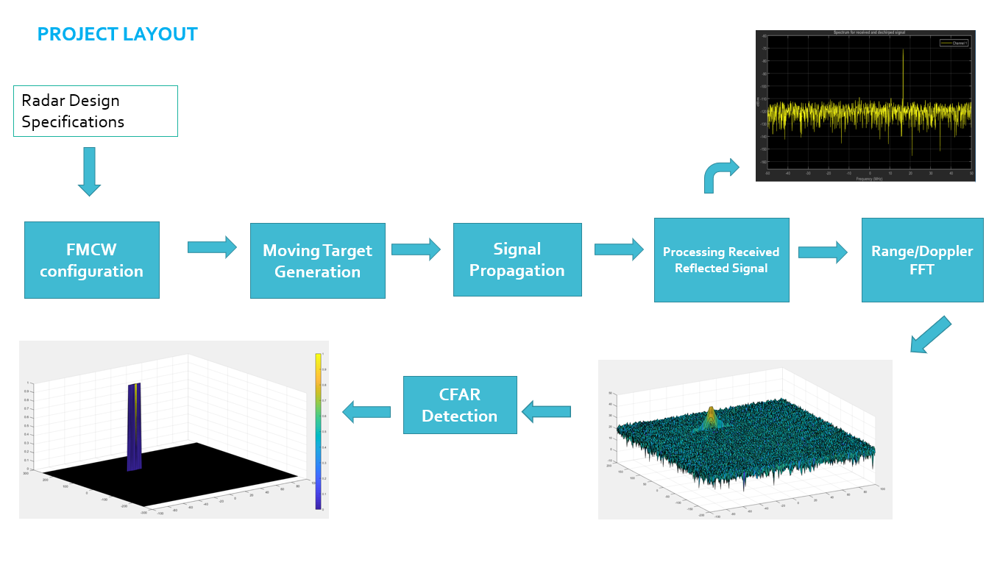

# Radar project

This README explains the implementation of the 2D CFAR (Constant False Alarm Rate) process in [Radar_Target_Generation_and_Detection.m](./Radar_Target_Generation_and_Detection.m) for the radar chapter project of the Udacity Sensor Fusion course.

## Project layout



## Radar system requirements

System Requirements defines the design of a Radar. The sensor fusion design for different driving scenarios requires different system configurations from a Radar. In this project, we will be designing a Radar based on the given system requirements:

| Parameter           | Value  |
| ------------------- | ------ |
| Frequency           | 77 GHz |
| Range Resolution    | 1 m    |
| Max Range           | 200 m  |
| Max velocity        | 70 m/s |
| Velocity resolution | 3 m/s  |

## Implementation Steps for the 2D CFAR Process

1. **Initialize parameters**:

   - Define the number of Training cells and Guard cells for both range and doppler dimensions.
   - Set the offset value for the threshold.

2. **Create CFAR map**:

   - Initialize a zero matrix of size `Nr/2 x Nd` to store the CFAR output.

3. **Slide window across Range Doppler Map**:

   - Iterate over each cell in the Range Doppler Map (RDM), excluding the edges.
   - For each cell:
     a. Extract a patch around the cell under test (CUT).
     b. Create a mask to exclude guard cells and CUT.
     c. Calculate the average noise level from the training cells.
     d. Apply the offset to get the threshold.
     e. Compare the CUT against the threshold.
     f. Set the corresponding cell in the CFAR map to 1 if above threshold, 0 otherwise.

4. **Suppress non-thresholded cells**:
   - Set the edges of the CFAR map to 0 to account for cells that couldn't be processed.

## Selection of Training & Guard Cells and Offset

- **Training Cells**:

  - Range dimension (Tr): 8
  - Doppler dimension (Td): 8

  These values were chosen to provide a sufficient number of samples for noise estimation while balancing computational complexity.

- **Guard Cells**:

  - Range dimension (Gr): 4
  - Doppler dimension (Gd): 4

  Guard cells help to prevent the target signal from corrupting the noise estimate. The values were selected to provide adequate isolation of the CUT.

- **Offset**: 6 dB

  The offset was set to 6 dB to adjust the threshold above the estimated noise level, reducing false alarms while maintaining sensitivity to actual targets.

## Suppression of Non-Thresholded Cells at the Edges

To handle the edges of the Range Doppler Map where a full window cannot be applied:

1. After processing, the edges of the CFAR map are explicitly set to 0:

   ```matlab
   cfar_map(1:(Tr+Gr), :) = 0;
   cfar_map((end-Tr-Gr+1):end, :) = 0;
   cfar_map(:, 1:(Td+Gd)) = 0;
   cfar_map(:, (end-Td-Gd+1):end) = 0;
   ```

2. This ensures that the CFAR map maintains the same dimensions as the original Range Doppler Map, with non-processed cells clearly identified as 0.

By following these steps, the 2D CFAR process effectively detects targets while minimizing false alarms and handling edge cases appropriately.
